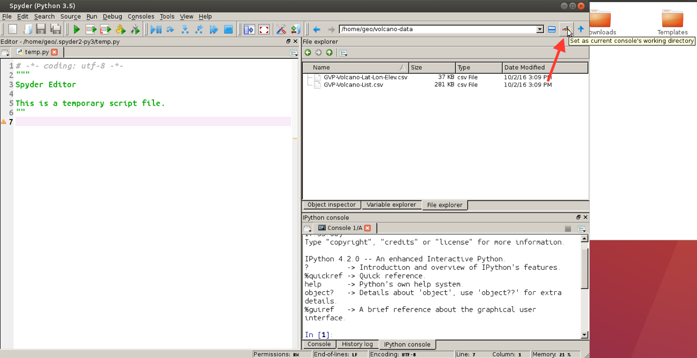

# Reading data from a file
Our first task in this week's lesson is to learn how to read data from files.
In Python this comprises two tasks: (1) Opening the file to be able to read in the contents, and (2) reading in the contents of the file.
In terms of how the data is read, there are several options of which we will see two.
Later in the course you will be introduced to more sophisticated libraries that can help with reading data files, but for now we will focus on the traditional way in which data files can be read in Python.

The data used in this part of the exercise is from the [Smithsonian Institution's volcano database](http://volcano.si.edu/).

## Topics
- How to open files using `with`
- `file.read()`, `file.readline()`
- Splitting strings, escape characters, assigning to variables
- Skipping headers and other unwanted file data (comment lines, etc.)

## Downloading and extracting the data
1. You can start by downloading the [volcano data zip file](https://github.com/Python-for-geo-people/Lesson-5-Reading-Writing/raw/master/Data/volcano-data.zip) we will be using for this part of the lesson.
  - The Firefox browser will likely download the file to the `Downloads` directory in the home directory of your computer instance.
  If so, you should move the file into the home directory using the file browser.
2. Once you have moved the `volcano-data.zip` file into your home directory, you can unzip the file using the `unzip` command in the Terminal window.

    ```bash
    $ cd $HOME
    $ unzip volcano-data.zip
    $ ls volcano-data
    GVP-Volcano-Lat-Lon-Elev.csv GVP-Volcano-List.csv
    ```
You should now have a directory titled `volcano-data` in your home directory.
It contains two files based on [version 4.5.1 of the Smithsonian Institution's Holocene volcano database (updated 23.9.2016)](http://volcano.si.edu/list_volcano_holocene.cfm):
  - `GVP-Volcano-List.csv`: The complete Holocene volcano database file in `.csv` format and with header lines.
  **Note**: Values are separated by semicolons (`;`) in this version of the file rather than commas (`,`).
  - `GVP-Volcano-Lat-Lon-Elev.csv`: The volcano ID, latitude, longitude and elevation for all volcanoes in the Holocene volcano database.
  There are no headers in this file and values are separated by commas (`,`).

## Preparing to read the data files in **Spyder**
1. Let's start by opening **Spyder** by either double clicking on its icon on the Desktop or typing `spyder` in the Terminal window.
2. In order to use the data in the downloaded files, we need to change the working directory in **Spyder** to be the `volcano-data` directory in your home directory.
This can be done by clicking on the **File explorer** tab in the upper right pane of the **Spyder** window and navigating to the `volcano-data` directory.
3. After navigating to that directory, you should see the two data files. However, you also need to tell the IPython window in **Spyder** that the `volcano-data` directory is where we will be working.
This can be done by clicking on the button shown below to set the console's working directory to the one selected in the **File explorer**.

    <br/>
    *Setting the working directory for IPython in Spyder*.

We should now be ready to continue and open a data file.

## Opening a file to be read in Python
In order to read data from a file in Python it must be opened, and opened in a *mode* that allows its data to be read.
1. Files in Python are opened for reading or writing using the `open()` function. We can open a file for reading in the IPython interpreter by typing

    ```python
    >>> infile = open("GVP-Volcano-Lat-Lon-Elev.csv", "r")
    ```
All this has done is define a variable `infile` that can be used to read the contents of a file.
The general format used for opening files in Python is `<filevar> = open(<filename>, <mode>)`, where `filevar` is the variable used to access the file, `filename` is the name of the file, and `mode` is either `"r"` for reading a file or `"w"` for writing to a file.


## Pro tips
- `file.readlines()`
