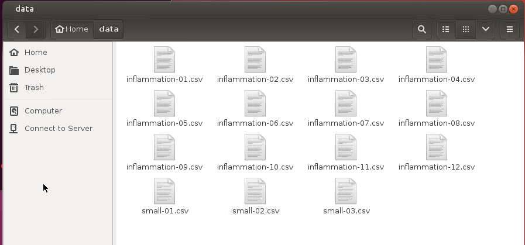

# Reading data from multiple files

## Sources

This lesson is partially based on the [Software Carpentry group's](http://software-carpentry.org/) lessons on [Programming with Python](http://swcarpentry.github.io/python-novice-inflammation/).

## Contents

 1. [Download data and extract](#1.-Download-data-and-extract)
 2. [Listing files](#2.-Listing-files)
 3. [Reading data from multiple files](#3.Reading-data-from-multiple-files)
 4. [Useful functions related to filepaths](#4.Useful-functions-related-to-filepaths)
 
- Using the `os` module (`os.path`, `os.makedirs()`
- Using the `glob` module for finding files with a common name/extension

## 1. Download and extract data

During this demo the data is about inflammation in patients who have been given a new treatment for arthritis that are stored in multiple data files that 
are stored in comma-separated values (CSV).
 
1. **<a href="https://github.com/Python-for-geo-people/Lesson-5-Reading-Writing/raw/master/Data/python-novice-inflammation-data.zip">Download the data</a>** (a zip-file) into the HOME folder of your computer instance
    - Note: _Mozilla may automatically donwnload the data into "Downloads" -folder. If so, move the *.zip package to HOME folder.  

2. Extract the data using `unzip` command in Terminal window:

  ```bash
  $ cd $HOME
  $ unzip python-novice-inflammation-data.zip 
  ```
3. Now we should have "data" folder in our HOME directory of our computer instance:

 


## 2. Listing files 

Listing and searching for file pathnames from file system can be done using a specific module called **[glob](https://docs.python.org/3/library/glob.html)**.
 
Let's import glob and list all files in a folder :

## 3. Reading data from multiple files

## 4. Useful functions related to filepaths

 - os.path.basename()
 - os.path.join()
 - os.path.isdir()
 - os.makedirs()
 - os.path.exists()

